# Instalação do Moodle no Ubuntu Server

### Pré-requisitos:

- Criar ou ter um usuário sudo;

- Instalar o Apache, MySQL e PHP (LAMP);


### 1° Passo - Criar um banco de dados MySQL para o Moodle

É necessário fazer login com root no MySQL com o comando: `mysql -u root -p`. Será solicitada a senha cadastrada por você na hora da instalação do MySQL.

Para criar o banco, digite: `CREATE DATABASE moodlebd;`. 

Depois de criar o banco, crie também um usuário para administrar esse banco. Para criar: `GRANT ALL ON moodlebd.* TO 'moodle'@'localhost' IDENTIFIED BY 'moodle123';`.

Pronto, você já tem um banco e um usuário para administrar o Moodle, para finalizar e atualizar os privilégios do MySQL, digite: `FLUSH PRIVILEGES;` e depois saia do MySQL: `EXIT`. 


### 2° Passo - Fazer download do Moodle

Para fazer o download basta digitar esse comando: `curl -O https://download.moodle.org/download.php/direct/stable310/moodle-latest-310.tgz`.

Extraia o arquivo: `tar -zxvf moodle-latest-310.tgz`.

Mova o arquivo extraído para /var/www/html/moodle: `sudo mv moodle /var/www/html/moodle`.

Crie uma pasta para armazenar os dados do Moodle, no meu caso resolvi criar ela no diretório /var: `sudo mkdir /var/moodledata`.

Para finalizar esse passo, faça os seguintes comandos para alterar as permissões nas pastas do Moodle: `sudo chown -R www-data:www-data /var/www/html/moodle/`, `sudo chmod -R 755 /var/www/html/moodle/` e `sudo chown www-data /var/moodledata`.


### 3° Passo - Ajustar configurações do Apache

Crie um arquivo de configuração do Moodle dentro do Apache: `sudo nano /etc/apache2/sites-available/moodle.conf`.

Cole o conteúdo a seguir para dentro do arquivo moodle.conf e em ServerName e Server Alias coloque o nome do seu site.

```
<VirtualHost *:80>
ServerAdmin admin@example.com
DocumentRoot /var/www/html/moodle/
ServerName example.com
ServerAlias www.example.com

<Directory /var/www/html/moodle/>
Options +FollowSymlinks
AllowOverride All
Require all granted
</Directory>

ErrorLog ${APACHE_LOG_DIR}/error.log
CustomLog ${APACHE_LOG_DIR}/access.log combined

</VirtualHost>
```

Para ativar o host virtual do Apache use os comandos: `sudo a2enmod rewrite` e `sudo a2ensite moodle.conf`.

Implemente as alterações, reiniciando o Apache: `sudo sustemctl restart apache2`.


### 4° Passo - Algumas configurações devem ser feitas através da interface front-end do Moodle

Acesse pelo seu navegador o endereço do seu servidor, no meu caso: `192.168.15.51/html/moodle`.

Selecione o idioma e clique em Próximo.

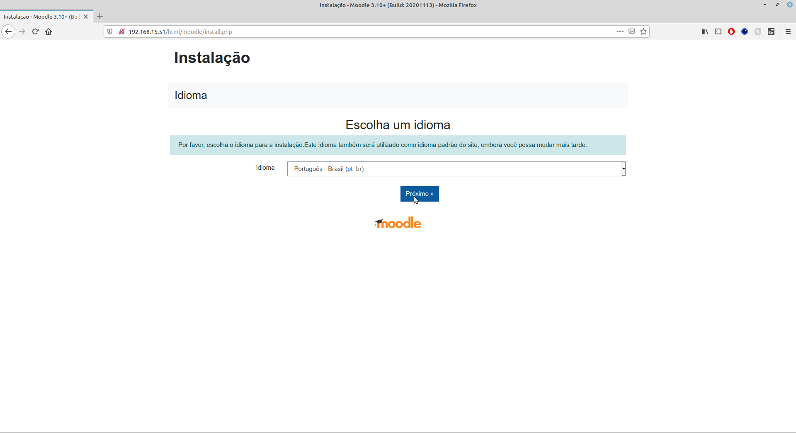

Na tela seguinte, você vai informar onde está o diretório de dados do Moodle, no meu caso em /var/moodledata.

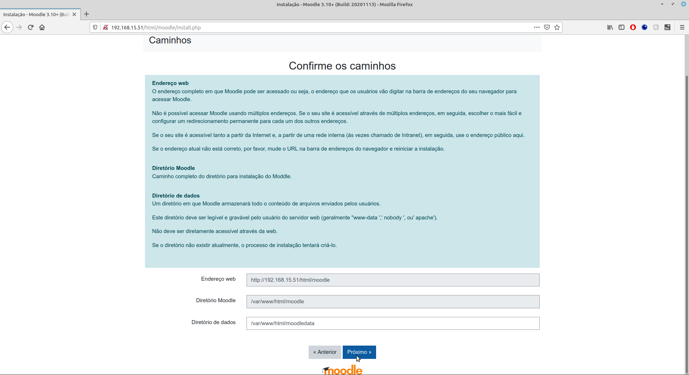

Escolha o driver do banco de dados.

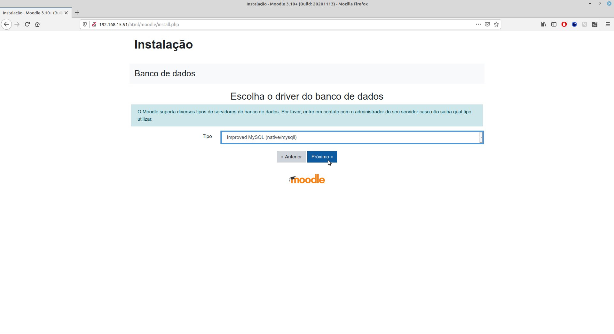

Nas configurações do banco de dados, você criou o bando moodledb e o usuário moodle, agora nessa página você vai colocar esses dados novamente.

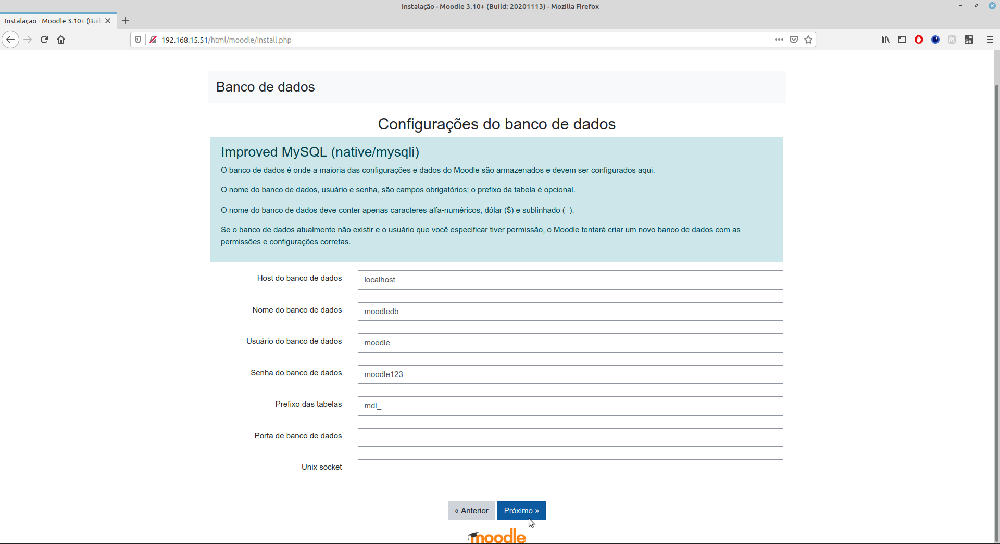

Leia os direitos autorais e Próximo.

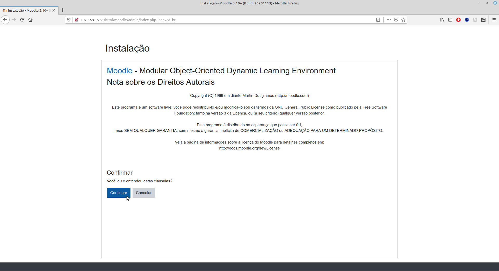

Nessa tela, você vai confirmar para o Moodle ajeitar tudo para você.

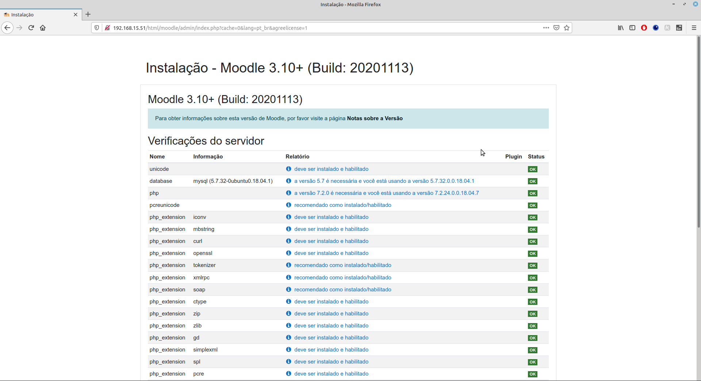

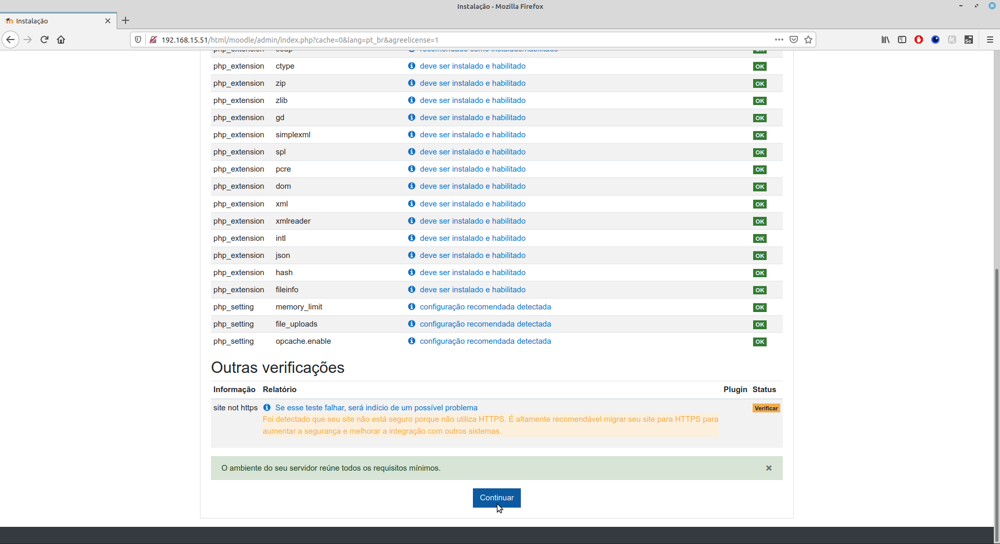

Vai demorar em torno de 10 à 15 minutos para instalar tudo. Depois você vai adicionar uma identificação do usuário, nova senha, nome, sobrenome e e-mail.

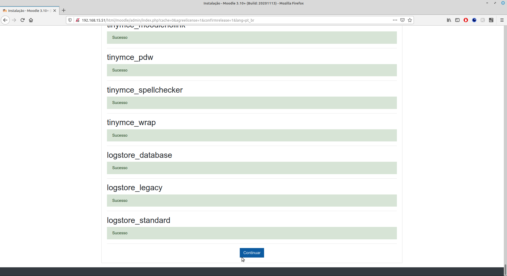

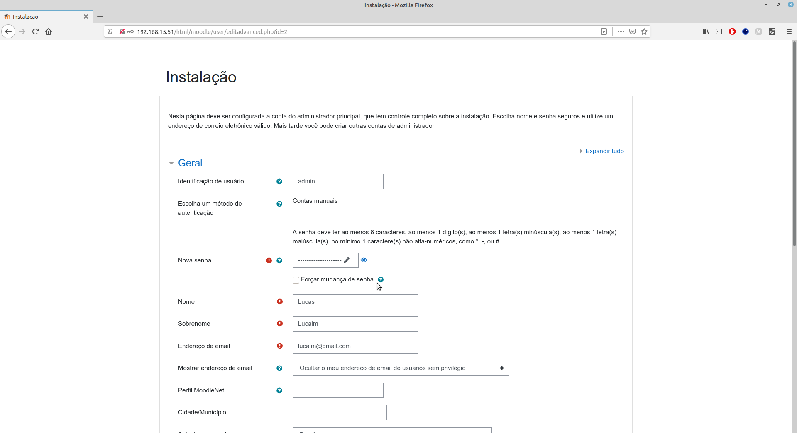

E outros dados...

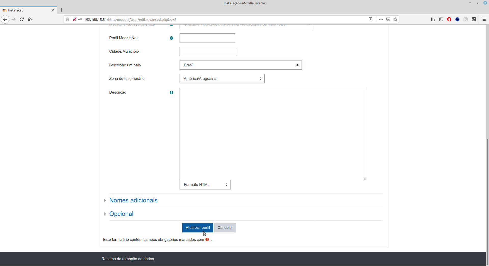

Na próxima tela você vai configurar as configurações do seu site, como: nomw completo do site, nome breve do site, descrição da página inicial e assim por diante.

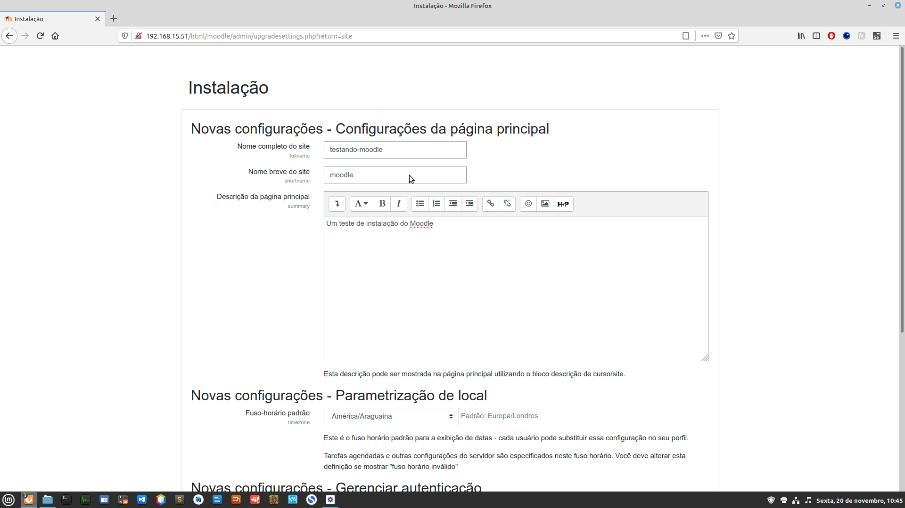

Depois só clicar em salvar as mudanças.

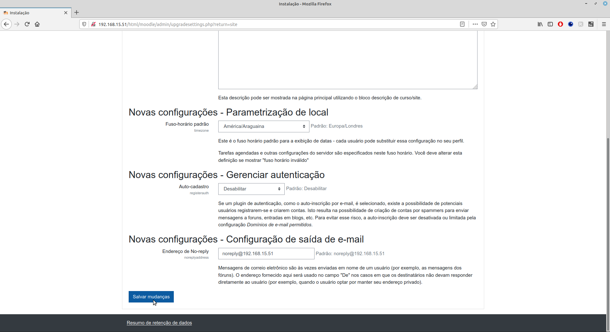

Você será enviado a página inicial do Moodle.

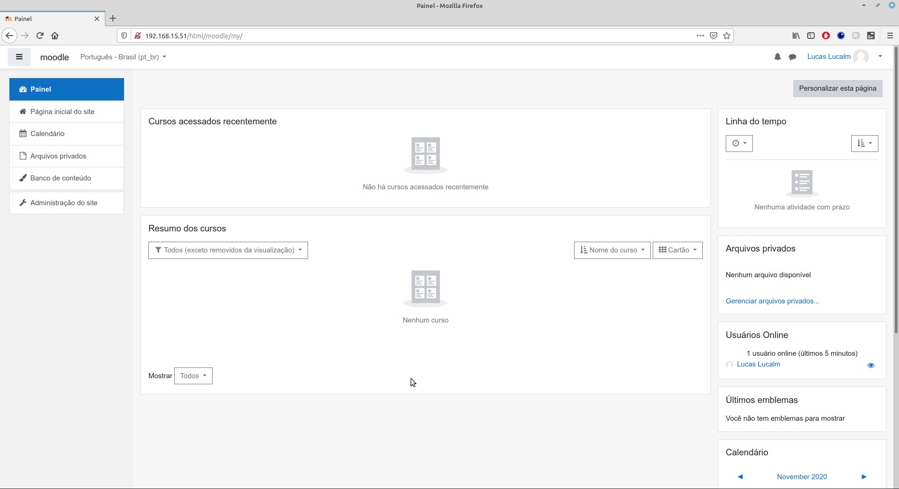


**Pronto, agora o seu Moodle está devidamente instalado!**